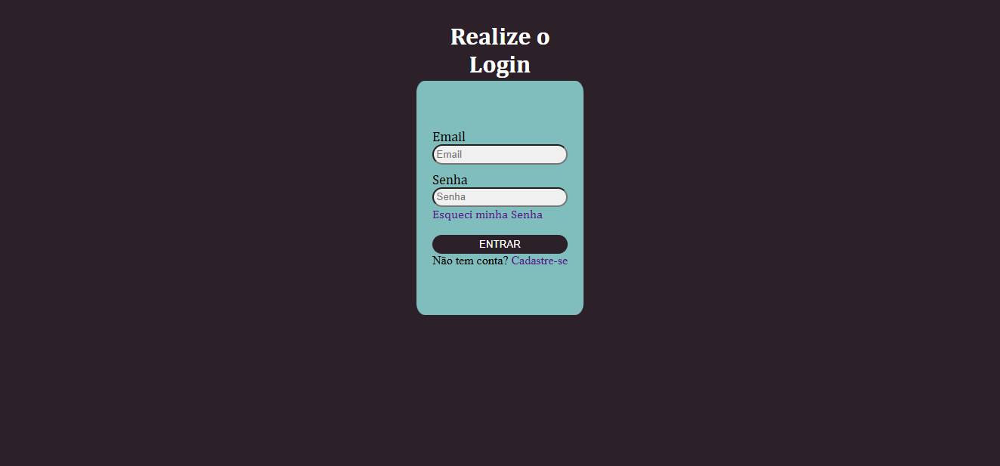
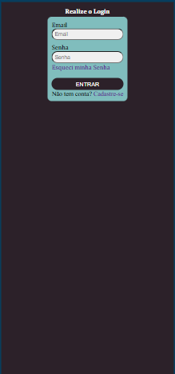

# PS-Focus-25.1 Pagina de Login 

## Motivação:
    -Treinar o Desenvolvimento de HTML e CSS utilizando um site de login.
    -Parte de processo seletivo da Focus Consultoria

## Principais Aprendizados:
    -Adaptar a pagina a diferentes tipos de dispositivos(responsividade)
    -Diferenças entre unidades de medidas(px,rem,em)

## Como executar:
    -Realize o download de todos os arquivos do projeto
    -Abra o arquivo "index.html" no seu navegador de preferencia

## Resultado Final:

### Desktop:

### Mobile:
